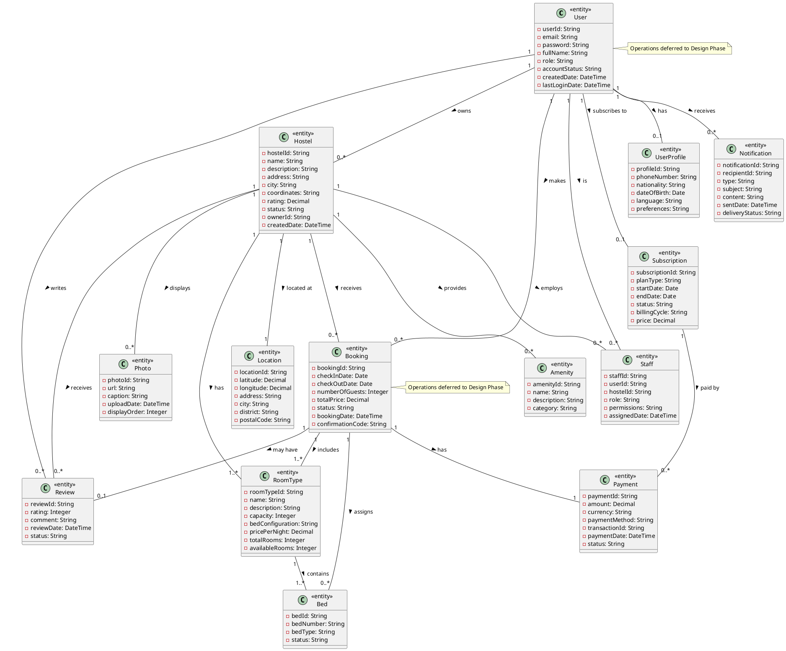

# Phase 1: Static Model - HostelViet

## System Context Diagram

### Actors and External Classes

| External Class        | Type   | Stereotype            | Input (→ System)                                                                                                    | Output (System →)                                                                                                        |
| --------------------- | ------ | --------------------- | ------------------------------------------------------------------------------------------------------------------- | ------------------------------------------------------------------------------------------------------------------------ |
| Traveler              | User   | `<<external user>>`   | Search criteria, booking request, registration data, credentials, review content, profile updates                   | Search results, hostel details, booking confirmation, availability status, email verification link, payment instructions |
| HostelOwner           | User   | `<<external user>>`   | Property details, room configuration, pricing data, staff assignments, availability updates, subscription selection | Dashboard analytics, booking notifications, revenue reports, property status, subscription confirmation                  |
| HostelStaff           | User   | `<<external user>>`   | Check-in data, check-out data, booking status updates, guest communication                                          | Booking details, guest information, task assignments, availability status                                                |
| PlatformAdministrator | User   | `<<external user>>`   | System configuration, user management commands, subscription management, platform settings                          | User account data, subscription status, platform metrics, system logs                                                    |
| PaymentGateway        | System | `<<external system>>` | Payment confirmation, transaction status, payment failure notification                                              | Payment request, transaction details, refund request                                                                     |
| EmailService          | System | `<<external system>>` | Email delivery status, bounce notification                                                                          | Verification email, booking confirmation, password reset link, notification message                                      |
| SMSGateway            | System | `<<external system>>` | SMS delivery status                                                                                                 | Booking reminder, urgent notification                                                                                    |
| CloudStorage          | System | `<<external system>>` | Upload confirmation, file URL                                                                                       | Property photos, hostel images, document files                                                                           |
| MapsAPI               | System | `<<external system>>` | Location coordinates, map data, distance calculation                                                                | Location query, address search request                                                                                   |

### System Context

```plantuml
@startuml System_Context
!define RECTANGLE class

' System boundary
RECTANGLE "<<software system>>\nHostelViet" as System

' External users
actor "<<external user>>\nTraveler" as Traveler
actor "<<external user>>\nHostelOwner" as Owner
actor "<<external user>>\nHostelStaff" as Staff
actor "<<external user>>\nPlatformAdministrator" as Admin

' External systems
RECTANGLE "<<external system>>\nPaymentGateway" as Payment
RECTANGLE "<<external system>>\nEmailService" as Email
RECTANGLE "<<external system>>\nSMSGateway" as SMS
RECTANGLE "<<external system>>\nCloudStorage" as Storage
RECTANGLE "<<external system>>\nMapsAPI" as Maps

' Data flows: External Users → System
Traveler --> System : Search criteria, booking request,\nregistration data, credentials,\nreview content, profile updates
Owner --> System : Property details, room configuration,\npricing data, staff assignments,\navailability updates, subscription selection
Staff --> System : Check-in data, check-out data,\nbooking status updates, guest communication
Admin --> System : System configuration, user management commands,\nsubscription management, platform settings

' Data flows: System → External Users
System --> Traveler : Search results, hostel details,\nbooking confirmation, availability status,\nemail verification link, payment instructions
System --> Owner : Dashboard analytics, booking notifications,\nrevenue reports, property status,\nsubscription confirmation
System --> Staff : Booking details, guest information,\ntask assignments, availability status
System --> Admin : User account data, subscription status,\nplatform metrics, system logs

' Data flows: External Systems → System
Payment --> System : Payment confirmation, transaction status,\npayment failure notification
Email --> System : Email delivery status, bounce notification
SMS --> System : SMS delivery status
Storage --> System : Upload confirmation, file URL
Maps --> System : Location coordinates, map data,\ndistance calculation

' Data flows: System → External Systems
System --> Payment : Payment request, transaction details,\nrefund request
System --> Email : Verification email, booking confirmation,\npassword reset link, notification message
System --> SMS : Booking reminder, urgent notification
System --> Storage : Property photos, hostel images,\ndocument files
System --> Maps : Location query, address search request

@enduml
```

### External Class Descriptions

**Traveler**

- **Type**: External user
- **Description**: Guest searching and booking hostel accommodations
- **Input Data (Traveler → System)**: Search criteria, booking request, registration data, credentials, review content, profile updates
- **Output Data (System → Traveler)**: Search results, hostel details, booking confirmation, availability status, email verification link, payment instructions

**HostelOwner**

- **Type**: External user
- **Description**: Property owner managing hostels and viewing business analytics
- **Input Data (HostelOwner → System)**: Property details, room configuration, pricing data, staff assignments, availability updates, subscription selection
- **Output Data (System → HostelOwner)**: Dashboard analytics, booking notifications, revenue reports, property status, subscription confirmation

**HostelStaff**

- **Type**: External user
- **Description**: Reception and operational staff managing daily hostel operations
- **Input Data (HostelStaff → System)**: Check-in data, check-out data, booking status updates, guest communication
- **Output Data (System → HostelStaff)**: Booking details, guest information, task assignments, availability status

**PlatformAdministrator**

- **Type**: External user
- **Description**: System administrator managing platform operations and users
- **Input Data (PlatformAdministrator → System)**: System configuration, user management commands, subscription management, platform settings
- **Output Data (System → PlatformAdministrator)**: User account data, subscription status, platform metrics, system logs

**PaymentGateway**

- **Type**: External system
- **Description**: Third-party payment processing service (SePay, VNPay)
- **Input Data (PaymentGateway → System)**: Payment confirmation, transaction status, payment failure notification
- **Output Data (System → PaymentGateway)**: Payment request, transaction details, refund request

**EmailService**

- **Type**: External system
- **Description**: Email delivery service for notifications and verifications (SendGrid, AWS SES)
- **Input Data (EmailService → System)**: Email delivery status, bounce notification
- **Output Data (System → EmailService)**: Verification email, booking confirmation, password reset link, notification message

**SMSGateway**

- **Type**: External system
- **Description**: SMS delivery service for urgent notifications (Twilio, local Vietnam provider)
- **Input Data (SMSGateway → System)**: SMS delivery status
- **Output Data (System → SMSGateway)**: Booking reminder, urgent notification

**CloudStorage**

- **Type**: External system
- **Description**: Cloud storage service for property images and documents (AWS S3, Cloudinary)
- **Input Data (CloudStorage → System)**: Upload confirmation, file URL
- **Output Data (System → CloudStorage)**: Property photos, hostel images, document files

**MapsAPI**

- **Type**: External system
- **Description**: Mapping and location service (Google Maps API)
- **Input Data (MapsAPI → System)**: Location coordinates, map data, distance calculation
- **Output Data (System → MapsAPI)**: Location query, address search request

---

## Entity Class Diagram

### Entities Identified

| Entity       | Attributes                                                                                              | Relationships                                                                                          |
| ------------ | ------------------------------------------------------------------------------------------------------- | ------------------------------------------------------------------------------------------------------ |
| User         | userId, email, password, fullName, role, accountStatus, createdDate, lastLoginDate                      | Has UserProfile, Makes Booking (Traveler), Owns Hostel (Owner), Manages Hostel (Staff)                 |
| UserProfile  | profileId, phoneNumber, nationality, dateOfBirth, language, preferences                                 | Belongs to User                                                                                        |
| Hostel       | hostelId, name, description, address, city, coordinates, rating, status, ownerId, createdDate           | Owned by User, Has RoomType, Has Amenity, Has Photo, Receives Booking, Has Review, Located at Location |
| RoomType     | roomTypeId, name, description, capacity, bedConfiguration, pricePerNight, totalRooms, availableRooms    | Belongs to Hostel, Has Bed                                                                             |
| Bed          | bedId, bedNumber, bedType, status                                                                       | Belongs to RoomType, Assigned in Booking                                                               |
| Booking      | bookingId, checkInDate, checkOutDate, numberOfGuests, totalPrice, status, bookingDate, confirmationCode | Made by User (Traveler), For Hostel, Includes RoomType, Assigns Bed, Has Payment, Has Review           |
| Payment      | paymentId, amount, currency, paymentMethod, transactionId, paymentDate, status                          | For Booking, Processed via PaymentGateway                                                              |
| Review       | reviewId, rating, comment, reviewDate, status                                                           | Written by User (Traveler), For Hostel, About Booking                                                  |
| Amenity      | amenityId, name, description, category                                                                  | Available at Hostel                                                                                    |
| Photo        | photoId, url, caption, uploadDate, displayOrder                                                         | For Hostel                                                                                             |
| Subscription | subscriptionId, planType, startDate, endDate, status, billingCycle, price                               | For User (Owner), Has Payment                                                                          |
| Location     | locationId, latitude, longitude, address, city, district, postalCode                                    | For Hostel                                                                                             |
| Staff        | staffId, userId, hostelId, role, permissions, assignedDate                                              | Is User, Works at Hostel                                                                               |
| Notification | notificationId, recipientId, type, subject, content, sentDate, deliveryStatus                           | Sent to User, Delivered via EmailService or SMSGateway                                                 |

### Entity Classes



### Entity Descriptions

**User**

- **Purpose**: Core entity representing all system users (Travelers, Owners, Staff, Administrators)
- **Key Attributes**:
    - `userId`: Unique identifier (String)
    - `email`: User email address for authentication (String)
    - `password`: Encrypted password (String)
    - `fullName`: User's full name (String)
    - `role`: User role (Traveler/Owner/Staff/Admin) (String)
    - `accountStatus`: Account state (Active/Unverified/Suspended/Deleted) (String)
    - `createdDate`: Account creation timestamp (DateTime)
    - `lastLoginDate`: Last successful login (DateTime)
- **Relationships**: Has UserProfile (0..1), Owns Hostel (0..\*), Makes Booking (0..\*), Writes Review (0..\*), Has Subscription (0..1), Is Staff (0..\*)

**UserProfile**

- **Purpose**: Extended user information and preferences
- **Key Attributes**:
    - `profileId`: Unique identifier (String)
    - `phoneNumber`: Contact phone number (String)
    - `nationality`: User's nationality (String)
    - `dateOfBirth`: Date of birth (Date)
    - `language`: Preferred language (Vietnamese/English) (String)
    - `preferences`: User preferences JSON (String)
- **Relationships**: Belongs to User (1)

**Hostel**

- **Purpose**: Hostel property managed by owners
- **Key Attributes**:
    - `hostelId`: Unique identifier (String)
    - `name`: Hostel name (String)
    - `description`: Detailed description (String)
    - `address`: Street address (String)
    - `city`: City location (String)
    - `coordinates`: GPS coordinates (String)
    - `rating`: Average rating 0-5 (Decimal)
    - `status`: Property status (Active/Inactive/Pending) (String)
    - `ownerId`: Reference to owner User (String)
    - `createdDate`: Property creation date (DateTime)
- **Relationships**: Owned by User (1), Has RoomType (1..\*), Has Amenity (0..\*), Has Photo (0..\*), Receives Booking (0..\*), Receives Review (0..\*), Located at Location (1), Employs Staff (0..\*)

**RoomType**

- **Purpose**: Type of accommodation within a hostel (dorm, private room)
- **Key Attributes**:
    - `roomTypeId`: Unique identifier (String)
    - `name`: Room type name (String)
    - `description`: Room description (String)
    - `capacity`: Maximum guests (Integer)
    - `bedConfiguration`: Bed setup description (String)
    - `pricePerNight`: Nightly rate (Decimal)
    - `totalRooms`: Total rooms of this type (Integer)
    - `availableRooms`: Currently available (Integer)
- **Relationships**: Belongs to Hostel (1), Contains Bed (1..\*)

**Bed**

- **Purpose**: Individual bed in dorm rooms
- **Key Attributes**:
    - `bedId`: Unique identifier (String)
    - `bedNumber`: Bed number/label (String)
    - `bedType`: Type (Bunk/Single/Double) (String)
    - `status`: Availability status (Available/Occupied/Maintenance) (String)
- **Relationships**: Belongs to RoomType (1), Assigned in Booking (0..\*)

**Booking**

- **Purpose**: Guest reservation for accommodation
- **Key Attributes**:
    - `bookingId`: Unique identifier (String)
    - `checkInDate`: Check-in date (Date)
    - `checkOutDate`: Check-out date (Date)
    - `numberOfGuests`: Number of guests (Integer)
    - `totalPrice`: Total booking price (Decimal)
    - `status`: Booking status (Pending/Confirmed/CheckedIn/CheckedOut/Cancelled) (String)
    - `bookingDate`: Timestamp when booking created (DateTime)
    - `confirmationCode`: Unique confirmation code (String)
- **Relationships**: Made by User (1), For Hostel (1), Includes RoomType (1..\*), Assigns Bed (0..\*), Has Payment (1), May have Review (0..1)

**Payment**

- **Purpose**: Financial transaction for booking or subscription
- **Key Attributes**:
    - `paymentId`: Unique identifier (String)
    - `amount`: Payment amount (Decimal)
    - `currency`: Currency code (VND) (String)
    - `paymentMethod`: Payment method (VietQR/VNPay) (String)
    - `transactionId`: External transaction ID (String)
    - `paymentDate`: Payment timestamp (DateTime)
    - `status`: Payment status (Pending/Completed/Failed/Refunded) (String)
- **Relationships**: For Booking (1) or For Subscription (1), Processed via PaymentGateway

**Review**

- **Purpose**: Guest review and rating of hostel after stay
- **Key Attributes**:
    - `reviewId`: Unique identifier (String)
    - `rating`: Rating 1-5 stars (Integer)
    - `comment`: Review text (String)
    - `reviewDate`: Review submission date (DateTime)
    - `status`: Review status (Pending/Published/Rejected) (String)
- **Relationships**: Written by User (1), For Hostel (1), About Booking (1)

**Amenity**

- **Purpose**: Hostel facilities and services
- **Key Attributes**:
    - `amenityId`: Unique identifier (String)
    - `name`: Amenity name (WiFi, Breakfast, Parking) (String)
    - `description`: Amenity description (String)
    - `category`: Category (Basic/Premium/Special) (String)
- **Relationships**: Available at Hostel (many-to-many)

**Photo**

- **Purpose**: Hostel property images
- **Key Attributes**:
    - `photoId`: Unique identifier (String)
    - `url`: Cloud storage URL (String)
    - `caption`: Photo description (String)
    - `uploadDate`: Upload timestamp (DateTime)
    - `displayOrder`: Display sequence (Integer)
- **Relationships**: For Hostel (1)

**Subscription**

- **Purpose**: Owner subscription plan for platform access
- **Key Attributes**:
    - `subscriptionId`: Unique identifier (String)
    - `planType`: Plan tier (Basic/Pro/Enterprise) (String)
    - `startDate`: Subscription start date (Date)
    - `endDate`: Subscription end date (Date)
    - `status`: Subscription status (Active/Expired/Cancelled) (String)
    - `billingCycle`: Billing frequency (Monthly/Yearly) (String)
    - `price`: Subscription price (Decimal)
- **Relationships**: For User (1), Has Payment (0..\*)

**Location**

- **Purpose**: Geographic location data for hostels
- **Key Attributes**:
    - `locationId`: Unique identifier (String)
    - `latitude`: GPS latitude (Decimal)
    - `longitude`: GPS longitude (Decimal)
    - `address`: Full address (String)
    - `city`: City name (String)
    - `district`: District/area (String)
    - `postalCode`: Postal code (String)
- **Relationships**: For Hostel (1)

**Staff**

- **Purpose**: Staff assignment and permissions
- **Key Attributes**:
    - `staffId`: Unique identifier (String)
    - `userId`: Reference to User (String)
    - `hostelId`: Reference to Hostel (String)
    - `role`: Staff role (Receptionist/Manager) (String)
    - `permissions`: Permission level (String)
    - `assignedDate`: Assignment date (DateTime)
- **Relationships**: Is User (1), Works at Hostel (1)

**Notification**

- **Purpose**: System notifications and communications
- **Key Attributes**:
    - `notificationId`: Unique identifier (String)
    - `recipientId`: Target user ID (String)
    - `type`: Notification type (Email/SMS/InApp) (String)
    - `subject`: Notification subject (String)
    - `content`: Notification body (String)
    - `sentDate`: Send timestamp (DateTime)
    - `deliveryStatus`: Delivery status (Sent/Delivered/Failed) (String)
- **Relationships**: Sent to User (1), Delivered via EmailService or SMSGateway

---

## Validation Checklist

- [x] At least 1 external class
- [x] System Context diagram renders
- [x] All actors mapped to external classes
- [x] Data flows documented on associations
- [x] Data flow labels use nouns (not verbs)
- [x] At least 1 entity class
- [x] Entity diagram renders
- [x] NO operations on entities

---

## Next Phase

Proceed to Phase 2: Object Structuring

```bash
/comet-ba-analysis object-structuring
```
