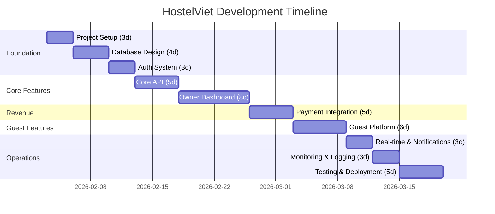

# HostelViet - Project Roadmap

**Status:** Planning Phase
**Start Date:** 2026-02-03
**Target MVP:** 2026-04-11 (45 working days)
**Version:** 1.0.0-alpha

---

## Executive Summary

Multi-tenant B2B SaaS platform for Vietnam hostel owners. Enables property/room/bed management, booking automation, and guest self-service portal. Revenue via subscription tiers (Basic/Pro/Enterprise) using Vietnamese payment gateways.

**Tech Stack:** Turborepo monorepo | NestJS + Next.js 15 | PostgreSQL + Prisma | tRPC + REST | Redis + RabbitMQ

---

## Milestones

| Milestone | Target Date | Status | Deliverables |
|-----------|-------------|--------|--------------|
| M1: Foundation | Week 2 (Feb 14) | Pending | Monorepo, DB schema, Auth system |
| M2: Owner MVP | Week 5 (Mar 7) | Pending | Property/booking management dashboard |
| M3: Revenue Ready | Week 7 (Mar 21) | Pending | Payment integration (SePay/VNPay) |
| M4: Public Launch | Week 8 (Apr 4) | Pending | Guest booking portal live |
| M5: Production | Week 9 (Apr 11) | Pending | Monitoring, CI/CD, deployment |

---

## Phase Timeline

---

## MVP Scope (Must-Have for Launch)

### Owner Dashboard (B2B)
- [x] Multi-tenant isolation (RLS)
- [x] Property/room/bed CRUD
- [x] Manual booking creation
- [x] Guest check-in/out
- [x] Basic reporting (occupancy rates)
- [x] Staff role management

### Guest Portal (B2C)
- [x] Public hostel search (city/dates)
- [x] Bed/room availability calendar
- [x] Self-service booking flow
- [x] Payment processing (VietQR/VNPay)
- [x] Booking confirmation emails

### Payment & Subscriptions
- [x] SePay integration (VietQR)
- [x] VNPay gateway
- [x] Subscription tiers (Basic/Pro/Enterprise)
- [x] Webhook handling (payment notifications)

### Infrastructure
- [x] JWT authentication + refresh tokens
- [x] PostgreSQL + Prisma ORM
- [x] tRPC API (type-safe)
- [x] Server-sent events (SSE)
- [x] Basic monitoring (ELK)

---

## Post-MVP Enhancements (v2.0+)

### Phase 2 Features
- Multi-language support (EN/VI/KO/ZH)
- Advanced analytics (revenue forecasting)
- Dynamic pricing engine
- Mobile apps (React Native)
- Channel manager integrations (Booking.com, Agoda)

### Phase 3 Features
- AI chatbot (guest support)
- Inventory management (linens, toiletries)
- POS integration (bar/cafe sales)
- WhatsApp/Zalo notifications
- Loyalty program

---

## Dependencies & Blockers

### External Dependencies
| Dependency | Status | Lead Time | Owner |
|------------|--------|-----------|-------|
| SePay merchant account | Not Started | 2-4 weeks | Finance team |
| VNPay merchant account | Not Started | 2-4 weeks | Finance team |
| AWS S3 bucket | Not Started | 1 day | DevOps |
| Domain + SSL certs | Not Started | 2 days | DevOps |
| PostgreSQL hosting | Not Started | 3 days | DevOps |
| Redis hosting | Not Started | 2 days | DevOps |

### Internal Blockers
- **Phase 03 → Phase 04:** Auth guards needed before API development
- **Phase 04 → Phase 05:** tRPC routers required for dashboard UI
- **Phase 05 → Phase 07:** Owner entity needed for subscriptions
- **Phase 07 → Phase 06:** Payment flow required before guest bookings

---

## Phase Details

| # | Phase | Duration | Start | End | Progress |
|---|-------|----------|-------|-----|----------|
| 01 | Project Setup | 3d | Feb 3 | Feb 5 | 0% |
| 02 | Database Design | 4d | Feb 6 | Feb 11 | 0% |
| 03 | Auth System | 3d | Feb 12 | Feb 14 | 0% |
| 04 | Core API | 5d | Feb 17 | Feb 21 | 0% |
| 05 | Owner Dashboard | 8d | Feb 24 | Mar 7 | 0% |
| 06 | Guest Platform | 6d | Mar 24 | Apr 2 | 0% |
| 07 | Payment Integration | 5d | Mar 10 | Mar 18 | 0% |
| 08 | Real-time & Notifications | 3d | Apr 3 | Apr 7 | 0% |
| 09 | Monitoring & Logging | 3d | Apr 8 | Apr 10 | 0% |
| 10 | Testing & Deployment | 5d | Apr 11 | Apr 17 | 0% |

---

## Risk Assessment

### High Risk
- **Payment gateway delays:** SePay/VNPay onboarding may exceed 4 weeks → Start merchant applications immediately
- **Multi-tenancy bugs:** RLS misconfiguration could leak data → Comprehensive security testing in Phase 10

### Medium Risk
- **Scope creep:** Owners request custom features mid-development → Strict MVP focus, post-launch enhancements only
- **Performance:** N+1 queries with nested Prisma relations → Query optimization in Phase 09

### Low Risk
- **UI/UX delays:** shadcn/ui components well-documented → Minimal design bottleneck

---

## Success Metrics

### Technical KPIs
- API response time: <200ms (p95)
- Database query time: <50ms (p95)
- Uptime: 99.9% SLA
- Test coverage: >80%

### Business KPIs
- 10 beta hostels onboarded (Month 1)
- 50 paid subscriptions (Month 3)
- 500 guest bookings/month (Month 6)
- <5% churn rate

---

## Related Documentation

- [Implementation Plan](../plans/260203-1316-hostel-management-saas/plan.md)
- [Tech Architecture Research](../plans/reports/researcher-260203-1204-tech-architecture.md)
- [Vietnam Payment Systems](../plans/reports/researcher-260203-1204-vietnam-payments.md)
- [Competitor Analysis](../plans/reports/researcher-260203-1204-hostel-saas-competitors.md)

---

**Last Updated:** 2026-02-03
**Next Review:** 2026-02-10 (Weekly sprint review)
