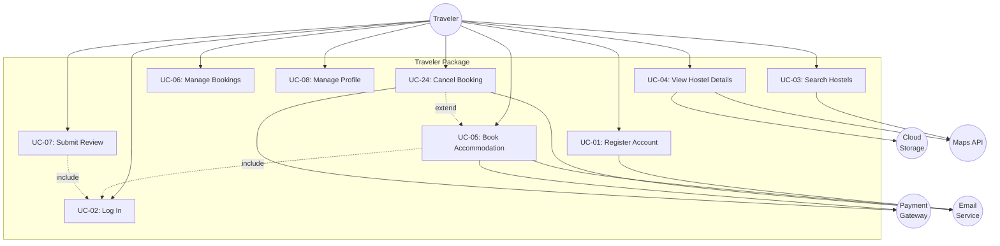
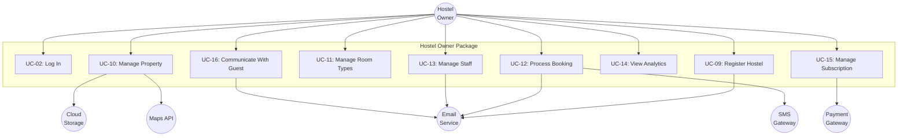
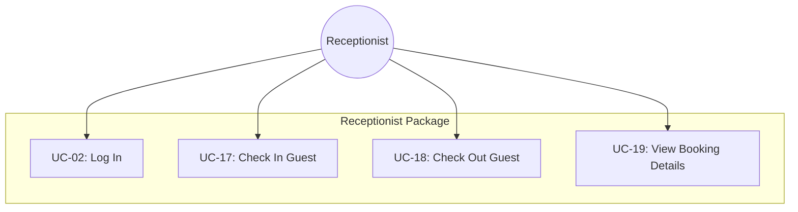
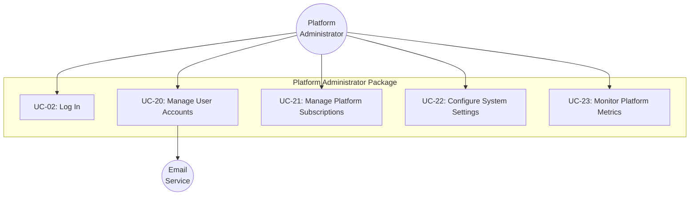
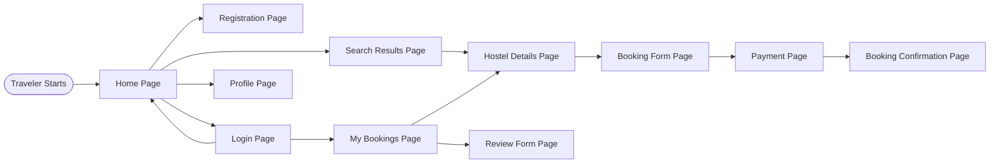
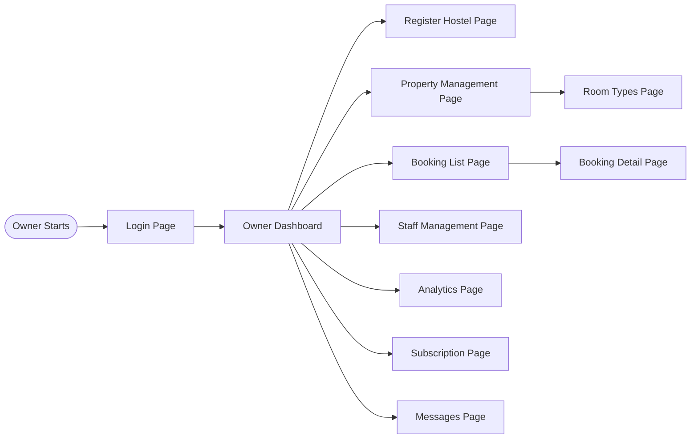
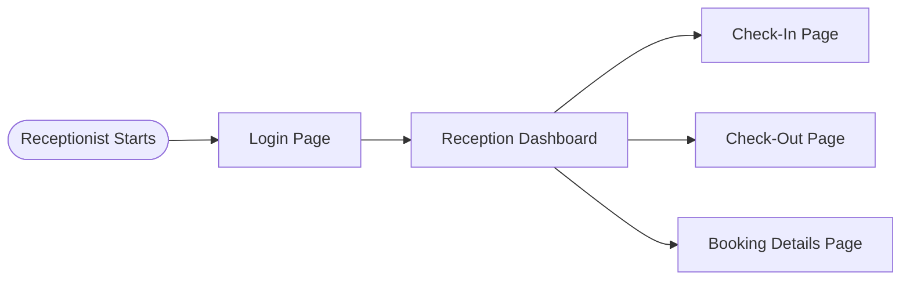
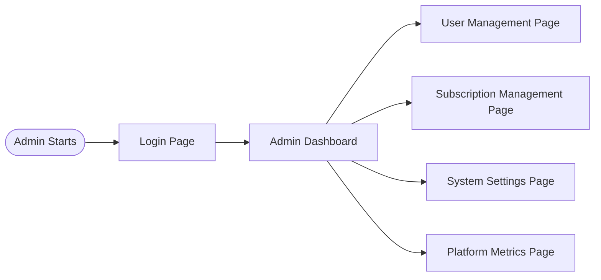

# 2. User Requirements

## 2.1 Actors

All actors validated using COMET 3-question test: External? Direct interaction? Role-based?

### Actor Identification

| Actor ID | Actor Name             | Type            | Classification        | Description                                                                                                                                                            |
| -------- | ---------------------- | --------------- | --------------------- | ---------------------------------------------------------------------------------------------------------------------------------------------------------------------- |
| A0       | Platform Administrator | Human User      | Primary               | SaaS platform staff who manages users, subscriptions, system configuration, and platform-wide operations                                                               |
| A1       | Hostel Owner           | Human User      | Primary (specialized) | Business owner or property manager who manages hostel properties, bookings, staff, and subscriptions. Inherits all Hostel Staff capabilities plus management functions |
| A2       | Receptionist           | Human User      | Primary (specialized) | Front desk staff who handles guest check-in/check-out and daily operations. Inherits all Hostel Staff capabilities                                                     |
| A2a      | Hostel Staff           | Human User      | Primary (generalized) | Authenticated staff member who performs front-desk operations (check-in, check-out, view bookings). Parent actor for Owner and Receptionist                            |
| A3       | Traveler               | Human User      | Primary               | Guest who searches for hostels and makes bookings                                                                                                                      |
| A4       | Payment Gateway        | External System | Secondary             | Third-party payment processor (SePay, VNPay) that receives payment requests from system and processes transactions                                                     |
| A5       | Email Service          | External System | Secondary             | Third-party email provider (SendGrid, AWS SES) that receives email requests from system and delivers notifications                                                     |
| A6       | SMS Gateway            | External System | Secondary             | Third-party SMS provider (Twilio, local Vietnam provider) that receives SMS requests from system and delivers messages                                                 |
| A7       | Cloud Storage          | External System | Secondary             | Object storage service (AWS S3, Cloudinary) that receives uploaded files from system and serves them for display                                                       |
| A8       | Maps API               | External System | Secondary             | Location services provider (Google Maps API) that receives geocoding requests from system and returns map data, coordinates, and place details                         |

### Actor Generalization Hierarchy

```
         [A2a: Hostel Staff]  ← Generalized actor
                ↑
                | (specialization)
          ------+------
          |           |
    [A2: Receptionist] [A1: Hostel Owner]
```

**Rationale**: Owner can perform all front-desk operations (check-in/check-out) that Receptionist can do, plus business management tasks. This generalization eliminates redundancy in use case associations and accurately models the permission hierarchy where Owner has superset of Receptionist capabilities.

### Actor Characteristics

#### A0: Platform Administrator

- **Type**: Human User
- **Classification**: Primary Actor
- **Role**: SaaS platform staff who manages users, subscriptions, system configuration, and platform-wide operations
- **Goals**: Maintain platform health, manage user accounts, handle subscription issues, configure system settings, monitor platform metrics
- **Frequency of Use**: Daily for platform operations
- **Technical Expertise**: High (system administration, technical operations)
- **Three Question Test Results**:
    - ✓ External to system (person outside system boundary, different from Hostel Owner)
    - ✓ Direct interaction with system (uses platform admin dashboard)
    - ✓ Specific, well-defined role (manages SaaS platform, not individual hostels)

#### A1: Hostel Owner

- **Type**: Human User
- **Classification**: Primary Actor (specialized from Hostel Staff)
- **Role**: Business owner or property manager who manages hostel properties, bookings, staff, and subscriptions
- **Specialization**: Inherits all Hostel Staff capabilities (check-in, check-out, view bookings) plus management functions
- **Goals**: Manage properties, track revenue, reduce administrative overhead, increase direct bookings
- **Frequency of Use**: Daily
- **Technical Expertise**: Moderate (uses Facebook, Zalo, basic software)
- **Three Question Test Results**:
    - ✓ External to system (person outside system boundary)
    - ✓ Direct interaction with system (uses owner dashboard)
    - ✓ Specific, well-defined role (generic role representing any hostel owner)

#### A2: Receptionist

- **Type**: Human User
- **Classification**: Primary Actor (specialized from Hostel Staff)
- **Role**: Front desk staff who handles guest check-in/check-out and daily operations
- **Specialization**: Inherits all Hostel Staff capabilities with no additional use cases
- **Goals**: Quick check-in workflow, track bed assignments, access booking details
- **Frequency of Use**: Daily during work shifts
- **Technical Expertise**: Basic (smartphone and computer skills)
- **Three Question Test Results**:
    - ✓ External to system (person outside system boundary)
    - ✓ Direct interaction with system (uses system for booking management)
    - ✓ Specific, well-defined role (generic front desk staff role)

#### A2a: Hostel Staff

- **Type**: Human User
- **Classification**: Primary Actor (generalized)
- **Role**: Authenticated staff member who performs front-desk operations (check-in, check-out, view bookings)
- **Goals**: Perform daily operational tasks at front desk
- **Frequency of Use**: Daily during work hours
- **Technical Expertise**: Basic to moderate (depends on specialization)
- **Generalization Purpose**: Parent actor for Owner (A1) and Receptionist (A2), eliminating redundant use case associations
- **Three Question Test Results**:
    - ✓ External to system (person outside system boundary)
    - ✓ Direct interaction with system (uses staff interfaces)
    - ✓ Specific, well-defined role (generic hostel staff role)

#### A3: Traveler

- **Type**: Human User
- **Role**: Guest who searches for hostels and makes bookings
- **Goals**: Find authentic hostels, book with local payment methods, view real-time availability
- **Frequency of Use**: Occasional (during trip planning)
- **Technical Expertise**: Comfortable with online booking platforms
- **Three Question Test Results**:
    - ✓ External to system (person outside system boundary)
    - ✓ Direct interaction with system (uses public portal)
    - ✓ Specific, well-defined role (generic traveler/guest role)

#### A4: Payment Gateway

- **Type**: External System
- **Classification**: Secondary Actor
- **Role**: Third-party payment processor (SePay, VNPay) that receives payment requests from system and processes transactions
- **Goals**: Process payments, send confirmations, ensure transaction security
- **Frequency of Use**: As needed (per transaction)
- **Technical Expertise**: N/A (automated system)
- **Three Question Test Results**:
    - ✓ External to system (third-party system)
    - ✓ Direct interaction with system (receives payment requests via API, sends webhooks back)
    - ✓ Specific, well-defined role (generic payment processor role)

#### A5: Email Service

- **Type**: External System
- **Classification**: Secondary Actor
- **Role**: Third-party email provider (SendGrid, AWS SES) that receives email requests from system and delivers notifications
- **Goals**: Deliver booking confirmations, notifications, and alerts
- **Frequency of Use**: As needed (per notification)
- **Technical Expertise**: N/A (automated system)
- **Three Question Test Results**:
    - ✓ External to system (third-party service)
    - ✓ Direct interaction with system (receives email requests via API from system, delivers to recipients)
    - ✓ Specific, well-defined role (generic email service role)

#### A6: SMS Gateway

- **Type**: External System
- **Classification**: Secondary Actor
- **Role**: Third-party SMS provider (Twilio, local Vietnam provider) that receives SMS requests from system and delivers messages
- **Goals**: Deliver urgent booking notifications and confirmations
- **Frequency of Use**: As needed (per urgent notification)
- **Technical Expertise**: N/A (automated system)
- **Three Question Test Results**:
    - ✓ External to system (third-party service)
    - ✓ Direct interaction with system (receives SMS requests via API from system, delivers to recipients)
    - ✓ Specific, well-defined role (generic SMS service role)

#### A7: Cloud Storage

- **Type**: External System
- **Classification**: Secondary Actor
- **Role**: Object storage service (AWS S3, Cloudinary) that receives uploaded files from system and serves them for display
- **Goals**: Store property photos, documents, and static assets; provide CDN delivery for fast access
- **Frequency of Use**: Continuous (per file upload/retrieve)
- **Technical Expertise**: N/A (automated system)
- **Three Question Test Results**:
    - ✓ External to system (third-party cloud service)
    - ✓ Direct interaction with system (receives file uploads via API, serves files back for display)
    - ✓ Specific, well-defined role (generic cloud storage role)

#### A8: Maps API

- **Type**: External System
- **Classification**: Secondary Actor
- **Role**: Location services provider (Google Maps API) that receives geocoding requests from system and returns map data, coordinates, and place details
- **Goals**: Provide geocoding (address to coordinates), reverse geocoding (coordinates to address), place details, static maps
- **Frequency of Use**: As needed (per location search, property listing, booking)
- **Technical Expertise**: N/A (automated system)
- **Three Question Test Results**:
    - ✓ External to system (third-party Google service)
    - ✓ Direct interaction with system (sends geocoding/place requests via API, receives map data back)
    - ✓ Specific, well-defined role (generic location services role)

### Rejected Actors

**Cleaning Staff** - Fails Q2 (direct interaction). Only views assigned tasks passively. Model as data displayed to Receptionist/Owner.

**Hostel Manager** - Duplicate of Hostel Owner role. Same capabilities and interactions.

**Monitoring System** (ELK, Prometheus, Grafana) - Fails Q1 (external) when self-hosted on same infrastructure. Internal infrastructure component, not an external actor.

**Internal Components** (Database, Controllers, Modules) - Fail Q1 (external). Not actors.

## 2.2 Use Cases

### Use Case Identification Method

Use cases derived from Product Functions (Section 1.2) mapped to validated actors (Section 2.1). Each use case passed the 4 acceptance criteria:

- **C1**: Delivers useful result to primary actor
- **C2**: Avoids functional decomposition (complete sequence)
- **C3**: Maintains black box view (WHAT not HOW)
- **C4**: Primary and secondary actors identified

### Use Case Overview

| UC ID | Use Case Name                 | Primary Actor                              | Secondary Actors                       | Priority | Status |
| ----- | ----------------------------- | ------------------------------------------ | -------------------------------------- | -------- | ------ |
| UC-01 | Register Account              | A3: Traveler                               | A5: Email Service                      | High     | Draft  |
| UC-02 | Log In                        | A2a: Hostel Staff, A3: Traveler, A0: Admin | —                                      | High     | Draft  |
| UC-03 | Search Hostels                | A3: Traveler                               | A8: Maps API                           | High     | Draft  |
| UC-04 | View Hostel Details           | A3: Traveler                               | A7: Cloud Storage, A8: Maps API        | High     | Draft  |
| UC-05 | Book Accommodation            | A3: Traveler                               | A4: Payment Gateway, A5: Email Service | High     | Draft  |
| UC-06 | Manage Bookings               | A3: Traveler                               | —                                      | High     | Draft  |
| UC-07 | Submit Review                 | A3: Traveler                               | —                                      | Medium   | Draft  |
| UC-08 | Manage Profile                | A3: Traveler                               | —                                      | Medium   | Draft  |
| UC-09 | Register Hostel               | A1: Hostel Owner                           | A5: Email Service                      | High     | Draft  |
| UC-10 | Manage Property               | A1: Hostel Owner                           | A7: Cloud Storage, A8: Maps API        | High     | Draft  |
| UC-11 | Manage Room Types             | A1: Hostel Owner                           | —                                      | High     | Draft  |
| UC-12 | Process Booking               | A1: Hostel Owner                           | A5: Email Service, A6: SMS Gateway     | High     | Draft  |
| UC-13 | Manage Staff                  | A1: Hostel Owner                           | A5: Email Service                      | Medium   | Draft  |
| UC-14 | View Analytics                | A1: Hostel Owner                           | —                                      | Medium   | Draft  |
| UC-15 | Manage Subscription           | A1: Hostel Owner                           | A4: Payment Gateway                    | High     | Draft  |
| UC-16 | Communicate With Guest        | A1: Hostel Owner                           | A5: Email Service                      | Medium   | Draft  |
| UC-17 | Check In Guest                | A2a: Hostel Staff                          | —                                      | High     | Draft  |
| UC-18 | Check Out Guest               | A2a: Hostel Staff                          | —                                      | High     | Draft  |
| UC-19 | View Booking Details          | A2a: Hostel Staff                          | —                                      | High     | Draft  |
| UC-20 | Manage User Accounts          | A0: Platform Administrator                 | A5: Email Service                      | High     | Draft  |
| UC-21 | Manage Platform Subscriptions | A0: Platform Administrator                 | —                                      | High     | Draft  |
| UC-22 | Configure System Settings     | A0: Platform Administrator                 | —                                      | Medium   | Draft  |
| UC-23 | Monitor Platform Metrics      | A0: Platform Administrator                 | —                                      | Medium   | Draft  |
| UC-24 | Cancel Booking                | A3: Traveler                               | A4: Payment Gateway, A5: Email Service | High     | Draft  |

### Use Case Relationships

| Relationship | Base Use Case             | Related Use Case          | Type          | Condition                                   |
| ------------ | ------------------------- | ------------------------- | ------------- | ------------------------------------------- |
| R1           | UC-05: Book Accommodation | UC-02: Log In             | `<<include>>` | Traveler must be authenticated to book      |
| R2           | UC-07: Submit Review      | UC-02: Log In             | `<<include>>` | Traveler must be authenticated to review    |
| R3           | UC-12: Process Booking    | UC-05: Book Accommodation | linked        | Owner processes what traveler books         |
| R4           | UC-05: Book Accommodation | UC-24: Cancel Booking     | `<<extend>>`  | Traveler cancels within cancellation window |

**R1 rationale**: UC-05 is incomplete without authentication — traveler cannot book without being logged in. Mandatory reuse across UC-05 and UC-07.

**R4 rationale**: UC-05 (booking flow) is complete without cancellation. Cancellation only applies if traveler chooses to cancel within 24-hour window. Extension point: after booking confirmed. Condition: traveler requests cancellation within policy window.

### Rejected Use Case Candidates

| Candidate               | Reason for Rejection                                 | Merged Into               |
| ----------------------- | ---------------------------------------------------- | ------------------------- |
| Pay for Booking         | C2 fail: fragment of booking flow                    | UC-05: Book Accommodation |
| Check Availability      | C2 fail: fragment of search/booking                  | UC-03: Search Hostels     |
| View Booking History    | C2 fail: fragment of manage bookings                 | UC-06: Manage Bookings    |
| Update Hostel Info      | C2 fail: fragment of manage property                 | UC-10: Manage Property    |
| Upload Property Photos  | C2 fail: fragment of manage property                 | UC-10: Manage Property    |
| Assign Bed              | C2 fail: fragment of check-in                        | UC-17: Check In Guest     |
| Receive Confirmation    | C1 fail: no actor-initiated goal (system auto-sends) | UC-05 step                |
| Manage Booking Calendar | C2 fail: fragment of room/booking management         | UC-11, UC-12              |

### Use Case Packages

#### Traveler Package (A3)

| UC ID | Use Case Name       | Priority |
| ----- | ------------------- | -------- |
| UC-01 | Register Account    | High     |
| UC-02 | Log In              | High     |
| UC-03 | Search Hostels      | High     |
| UC-04 | View Hostel Details | High     |
| UC-05 | Book Accommodation  | High     |
| UC-06 | Manage Bookings     | High     |
| UC-07 | Submit Review       | Medium   |
| UC-08 | Manage Profile      | Medium   |
| UC-24 | Cancel Booking      | High     |

**Package rationale**: Covers complete traveler journey from discovery → booking → post-stay review. UC-01/UC-02 enable access; UC-03/UC-04 enable discovery; UC-05/UC-06/UC-24 enable transactions; UC-07/UC-08 enable engagement.

#### Hostel Staff Package (A2a) — Generalized

| UC ID | Use Case Name        | Priority |
| ----- | -------------------- | -------- |
| UC-02 | Log In               | High     |
| UC-17 | Check In Guest       | High     |
| UC-18 | Check Out Guest      | High     |
| UC-19 | View Booking Details | High     |

**Package rationale**: Common front-desk operations inherited by both Receptionist (A2) and Hostel Owner (A1). UC-02 enables authentication; UC-17/UC-18/UC-19 enable daily operational tasks.

#### Hostel Owner Package (A1) — Specialized

| UC ID | Use Case Name          | Priority |
| ----- | ---------------------- | -------- |
| UC-09 | Register Hostel        | High     |
| UC-10 | Manage Property        | High     |
| UC-11 | Manage Room Types      | High     |
| UC-12 | Process Booking        | High     |
| UC-13 | Manage Staff           | Medium   |
| UC-14 | View Analytics         | Medium   |
| UC-15 | Manage Subscription    | High     |
| UC-16 | Communicate With Guest | Medium   |

**Inherited from Hostel Staff (A2a)**: UC-02, UC-17, UC-18, UC-19

**Package rationale**: Owner inherits all front-desk capabilities from Hostel Staff plus management functions. UC-09/UC-15 enable onboarding; UC-10/UC-11 enable property configuration; UC-12/UC-16 enable booking operations; UC-13/UC-14 enable staff/analytics management.

#### Receptionist Package (A2) — Specialized

**Inherited from Hostel Staff (A2a)**: UC-02, UC-17, UC-18, UC-19

**Additional use cases**: None

**Package rationale**: Receptionist inherits all front-desk operations from Hostel Staff with no additional capabilities. Minimal scope matches basic technical expertise and shift-based usage pattern.

#### Platform Administrator Package (A0)

| UC ID | Use Case Name                 | Priority |
| ----- | ----------------------------- | -------- |
| UC-20 | Manage User Accounts          | High     |
| UC-21 | Manage Platform Subscriptions | High     |
| UC-22 | Configure System Settings     | Medium   |
| UC-23 | Monitor Platform Metrics      | Medium   |

**Package rationale**: Covers platform-level operations distinct from hostel-level management. UC-20/UC-21 handle user/billing oversight; UC-22/UC-23 handle system health.

## 2.3 Use Case Diagrams

### Overall System Use Case Diagram

```mermaid
graph TB
    A0((Platform<br/>Administrator))
    A1((Hostel<br/>Owner))
    A2((Receptionist))
    A3((Traveler))
    A4((Payment<br/>Gateway))
    A5((Email<br/>Service))
    A6((SMS<br/>Gateway))
    A7((Cloud<br/>Storage))
    A8((Maps API))

    subgraph HostelViet["HostelViet System"]
        UC01[UC-01: Register Account]
        UC02[UC-02: Log In]
        UC03[UC-03: Search Hostels]
        UC04[UC-04: View Hostel Details]
        UC05[UC-05: Book Accommodation]
        UC06[UC-06: Manage Bookings]
        UC07[UC-07: Submit Review]
        UC08[UC-08: Manage Profile]
        UC09[UC-09: Register Hostel]
        UC10[UC-10: Manage Property]
        UC11[UC-11: Manage Room Types]
        UC12[UC-12: Process Booking]
        UC13[UC-13: Manage Staff]
        UC14[UC-14: View Analytics]
        UC15[UC-15: Manage Subscription]
        UC16[UC-16: Communicate With Guest]
        UC17[UC-17: Check In Guest]
        UC18[UC-18: Check Out Guest]
        UC19[UC-19: View Booking Details]
        UC20[UC-20: Manage User Accounts]
        UC21[UC-21: Manage Platform Subscriptions]
        UC22[UC-22: Configure System Settings]
        UC23[UC-23: Monitor Platform Metrics]
        UC24[UC-24: Cancel Booking]
    end

    A3 --> UC01
    A3 --> UC02
    A3 --> UC03
    A3 --> UC04
    A3 --> UC05
    A3 --> UC06
    A3 --> UC07
    A3 --> UC08
    A3 --> UC24

    A1 --> UC02
    A1 --> UC09
    A1 --> UC10
    A1 --> UC11
    A1 --> UC12
    A1 --> UC13
    A1 --> UC14
    A1 --> UC15
    A1 --> UC16

    A2 --> UC02
    A2 --> UC17
    A2 --> UC18
    A2 --> UC19

    A0 --> UC02
    A0 --> UC20
    A0 --> UC21
    A0 --> UC22
    A0 --> UC23

    UC05 -.->|include| UC02
    UC07 -.->|include| UC02
    UC24 -.->|extend| UC05

    UC01 --> A5
    UC05 --> A4
    UC05 --> A5
    UC03 --> A8
    UC04 --> A7
    UC04 --> A8
    UC09 --> A5
    UC10 --> A7
    UC10 --> A8
    UC12 --> A5
    UC12 --> A6
    UC13 --> A5
    UC15 --> A4
    UC16 --> A5
    UC20 --> A5
    UC24 --> A4
    UC24 --> A5
```



### Package Diagrams

#### Traveler Package Diagram (A3)



#### Hostel Owner Package Diagram (A1)



#### Receptionist Package Diagram (A2)



#### Platform Administrator Package Diagram (A0)



### Screen Flow Diagrams

#### Traveler Screen Flow



#### Hostel Owner Screen Flow



#### Receptionist Screen Flow



#### Platform Administrator Screen Flow



## 2.4 Use Case Specifications

Detailed use case specifications are maintained in separate files within the `use-cases/` directory. Each specification follows the COMET use case template with: actors, preconditions, main flow, alternative flows, postconditions, and non-functional requirements.

**Traveler Package:**

- [UC-01-register-account.md](./use-cases/UC-01-register-account.md)
- [UC-02-log-in.md](./use-cases/UC-02-log-in.md)
- [UC-03-search-hostels.md](./use-cases/UC-03-search-hostels.md)
- [UC-04-view-hostel-details.md](./use-cases/UC-04-view-hostel-details.md)
- [UC-05-book-accommodation.md](./use-cases/UC-05-book-accommodation.md)
- [UC-06-manage-bookings.md](./use-cases/UC-06-manage-bookings.md)
- [UC-07-submit-review.md](./use-cases/UC-07-submit-review.md)
- [UC-08-manage-profile.md](./use-cases/UC-08-manage-profile.md)
- [UC-24-cancel-booking.md](./use-cases/UC-24-cancel-booking.md)

**Hostel Owner Package:**

- [UC-09-register-hostel.md](./use-cases/UC-09-register-hostel.md)
- [UC-10-manage-property.md](./use-cases/UC-10-manage-property.md)
- [UC-11-manage-room-types.md](./use-cases/UC-11-manage-room-types.md)
- [UC-12-process-booking.md](./use-cases/UC-12-process-booking.md)
- [UC-13-manage-staff.md](./use-cases/UC-13-manage-staff.md)
- [UC-14-view-analytics.md](./use-cases/UC-14-view-analytics.md)
- [UC-15-manage-subscription.md](./use-cases/UC-15-manage-subscription.md)
- [UC-16-communicate-with-guest.md](./use-cases/UC-16-communicate-with-guest.md)

**Receptionist Package:**

- [UC-17-check-in-guest.md](./use-cases/UC-17-check-in-guest.md)
- [UC-18-check-out-guest.md](./use-cases/UC-18-check-out-guest.md)
- [UC-19-view-booking-details.md](./use-cases/UC-19-view-booking-details.md)

**Platform Administrator Package:**

- [UC-20-manage-user-accounts.md](./use-cases/UC-20-manage-user-accounts.md)
- [UC-21-manage-platform-subscriptions.md](./use-cases/UC-21-manage-platform-subscriptions.md)
- [UC-22-configure-system-settings.md](./use-cases/UC-22-configure-system-settings.md)
- [UC-23-monitor-platform-metrics.md](./use-cases/UC-23-monitor-platform-metrics.md)

---

_All use cases validated against 4 acceptance criteria (C1-C4). Black box compliance maintained. Actor validation ensures proper external perspective modeling._
