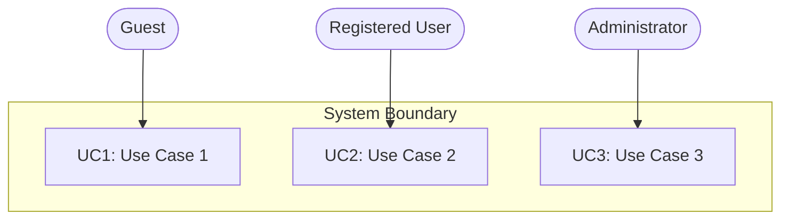
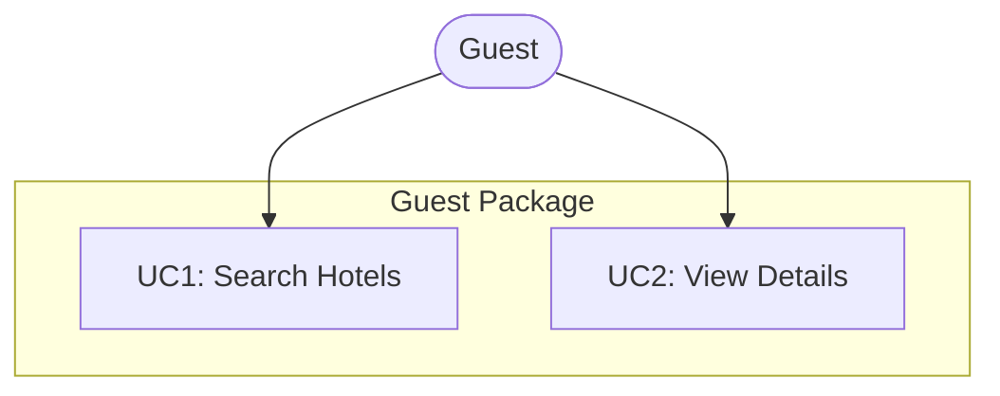
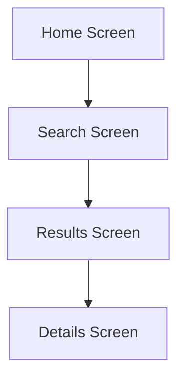

# 2. User Requirements

## 2.1 Actors

All actors validated using COMET 3-question test: External? Direct interaction? Role-based?

### Actor Identification

| Actor ID | Actor Name | Type | Classification | Description |
|----------|-----------|------|----------------|-------------|
| A0 | Platform Administrator | Human User | Primary | SaaS platform staff who manages users, subscriptions, system configuration, and platform-wide operations |
| A1 | Hostel Owner | Human User | Primary | Business owner or property manager who manages hostel properties, bookings, staff, and subscriptions |
| A2 | Receptionist | Human User | Primary | Front desk staff who handles guest check-in/check-out and daily operations |
| A3 | Traveler | Human User | Primary | Guest who searches for hostels and makes bookings |
| A4 | Payment Gateway | External System | Secondary | Third-party payment processor (SePay, VNPay) that receives payment requests from system and processes transactions |
| A5 | Email Service | External System | Secondary | Third-party email provider (SendGrid, AWS SES) that receives email requests from system and delivers notifications |
| A6 | SMS Gateway | External System | Secondary | Third-party SMS provider (Twilio, local Vietnam provider) that receives SMS requests from system and delivers messages |
| A7 | Cloud Storage | External System | Secondary | Object storage service (AWS S3, Cloudinary) that receives uploaded files from system and serves them for display |
| A8 | Maps API | External System | Secondary | Location services provider (Google Maps API) that receives geocoding requests from system and returns map data, coordinates, and place details |

### Actor Characteristics

#### A0: Platform Administrator

- **Type**: Human User
- **Classification**: Primary Actor
- **Role**: SaaS platform staff who manages users, subscriptions, system configuration, and platform-wide operations
- **Goals**: Maintain platform health, manage user accounts, handle subscription issues, configure system settings, monitor platform metrics
- **Frequency of Use**: Daily for platform operations
- **Technical Expertise**: High (system administration, technical operations)
- **Three Question Test Results**:
  - ✓ External to system (person outside system boundary, different from Hostel Owner)
  - ✓ Direct interaction with system (uses platform admin dashboard)
  - ✓ Specific, well-defined role (manages SaaS platform, not individual hostels)

#### A1: Hostel Owner

- **Type**: Human User
- **Role**: Business owner or property manager who manages hostel properties, bookings, staff, and subscriptions
- **Goals**: Manage properties, track revenue, reduce administrative overhead, increase direct bookings
- **Frequency of Use**: Daily
- **Technical Expertise**: Moderate (uses Facebook, Zalo, basic software)
- **Three Question Test Results**:
  - ✓ External to system (person outside system boundary)
  - ✓ Direct interaction with system (uses owner dashboard)
  - ✓ Specific, well-defined role (generic role representing any hostel owner)

#### A2: Receptionist

- **Type**: Human User
- **Role**: Front desk staff who handles guest check-in/check-out and daily operations
- **Goals**: Quick check-in workflow, track bed assignments, access booking details
- **Frequency of Use**: Daily during work shifts
- **Technical Expertise**: Basic (smartphone and computer skills)
- **Three Question Test Results**:
  - ✓ External to system (person outside system boundary)
  - ✓ Direct interaction with system (uses system for booking management)
  - ✓ Specific, well-defined role (generic front desk staff role)

#### A3: Traveler

- **Type**: Human User
- **Role**: Guest who searches for hostels and makes bookings
- **Goals**: Find authentic hostels, book with local payment methods, view real-time availability
- **Frequency of Use**: Occasional (during trip planning)
- **Technical Expertise**: Comfortable with online booking platforms
- **Three Question Test Results**:
  - ✓ External to system (person outside system boundary)
  - ✓ Direct interaction with system (uses public portal)
  - ✓ Specific, well-defined role (generic traveler/guest role)

#### A4: Payment Gateway

- **Type**: External System
- **Classification**: Secondary Actor
- **Role**: Third-party payment processor (SePay, VNPay) that receives payment requests from system and processes transactions
- **Goals**: Process payments, send confirmations, ensure transaction security
- **Frequency of Use**: As needed (per transaction)
- **Technical Expertise**: N/A (automated system)
- **Three Question Test Results**:
  - ✓ External to system (third-party system)
  - ✓ Direct interaction with system (receives payment requests via API, sends webhooks back)
  - ✓ Specific, well-defined role (generic payment processor role)

#### A5: Email Service

- **Type**: External System
- **Classification**: Secondary Actor
- **Role**: Third-party email provider (SendGrid, AWS SES) that receives email requests from system and delivers notifications
- **Goals**: Deliver booking confirmations, notifications, and alerts
- **Frequency of Use**: As needed (per notification)
- **Technical Expertise**: N/A (automated system)
- **Three Question Test Results**:
  - ✓ External to system (third-party service)
  - ✓ Direct interaction with system (receives email requests via API from system, delivers to recipients)
  - ✓ Specific, well-defined role (generic email service role)

#### A6: SMS Gateway

- **Type**: External System
- **Classification**: Secondary Actor
- **Role**: Third-party SMS provider (Twilio, local Vietnam provider) that receives SMS requests from system and delivers messages
- **Goals**: Deliver urgent booking notifications and confirmations
- **Frequency of Use**: As needed (per urgent notification)
- **Technical Expertise**: N/A (automated system)
- **Three Question Test Results**:
  - ✓ External to system (third-party service)
  - ✓ Direct interaction with system (receives SMS requests via API from system, delivers to recipients)
  - ✓ Specific, well-defined role (generic SMS service role)

#### A7: Cloud Storage

- **Type**: External System
- **Classification**: Secondary Actor
- **Role**: Object storage service (AWS S3, Cloudinary) that receives uploaded files from system and serves them for display
- **Goals**: Store property photos, documents, and static assets; provide CDN delivery for fast access
- **Frequency of Use**: Continuous (per file upload/retrieve)
- **Technical Expertise**: N/A (automated system)
- **Three Question Test Results**:
  - ✓ External to system (third-party cloud service)
  - ✓ Direct interaction with system (receives file uploads via API, serves files back for display)
  - ✓ Specific, well-defined role (generic cloud storage role)

#### A8: Maps API

- **Type**: External System
- **Classification**: Secondary Actor
- **Role**: Location services provider (Google Maps API) that receives geocoding requests from system and returns map data, coordinates, and place details
- **Goals**: Provide geocoding (address to coordinates), reverse geocoding (coordinates to address), place details, static maps
- **Frequency of Use**: As needed (per location search, property listing, booking)
- **Technical Expertise**: N/A (automated system)
- **Three Question Test Results**:
  - ✓ External to system (third-party Google service)
  - ✓ Direct interaction with system (sends geocoding/place requests via API, receives map data back)
  - ✓ Specific, well-defined role (generic location services role)

### Rejected Actors

**Cleaning Staff** - Fails Q2 (direct interaction). Only views assigned tasks passively. Model as data displayed to Receptionist/Owner.

**Hostel Manager** - Duplicate of Hostel Owner role. Same capabilities and interactions.

**Monitoring System** (ELK, Prometheus, Grafana) - Fails Q1 (external) when self-hosted on same infrastructure. Internal infrastructure component, not an external actor.

**Internal Components** (Database, Controllers, Modules) - Fail Q1 (external). Not actors.

## 2.2 Use Cases

<!-- TODO: Workflow Step 7 - Identify use cases per actor -->
<!-- Organize by actor packages (Guest, Registered User, Admin, etc.) -->

### Use Case Overview

| UC ID | Use Case Name | Primary Actor | Priority | Status |
|-------|--------------|---------------|----------|--------|
| UC1 | [Use Case Name] | [Actor] | High/Medium/Low | Draft/Review/Approved |
| UC2 | [Use Case Name] | [Actor] | High/Medium/Low | Draft/Review/Approved |

### Use Case Packages

#### Guest Package
- UC1: [Use Case Name]
- UC2: [Use Case Name]

#### Registered User Package
- UC3: [Use Case Name]
- UC4: [Use Case Name]

#### Administrator Package
- UC5: [Use Case Name]
- UC6: [Use Case Name]

## 2.3 Use Case Diagrams

<!-- TODO: Workflow Step 8 - Generate diagrams -->
<!-- Use generate-mermaid-usecase-diagram.py with --type overall|package|screen -->

### Overall System Use Case Diagram

### Package Diagrams

#### Guest Package Diagram

### Screen Flow Diagrams

#### Guest Screen Flow

## 2.4 Use Case Specifications

<!-- TODO: Workflow Step 9 - Write detailed specifications -->
<!-- Use generate-usecase-specification-table.py to create UC-XX-name.md files -->
<!-- See use-cases/ directory for individual specifications -->

Detailed use case specifications are maintained in separate files:
- [UC-01-use-case-name.md](./use-cases/UC-01-use-case-name.md)
- [UC-02-use-case-name.md](./use-cases/UC-02-use-case-name.md)

---
*Actor validation ensures proper black box modeling. All actors must pass the three-question test.*
