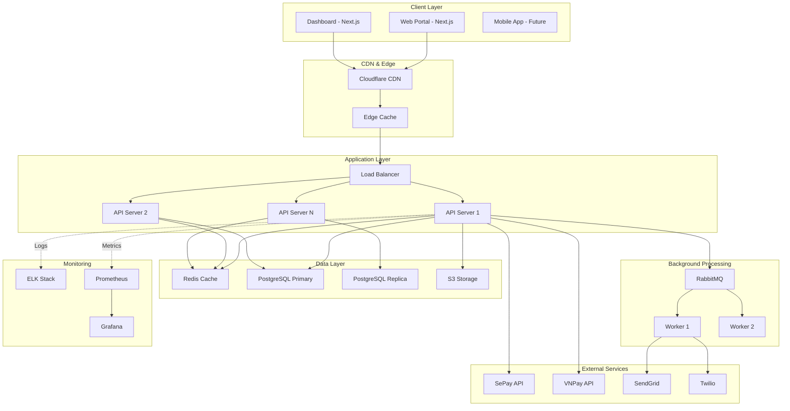
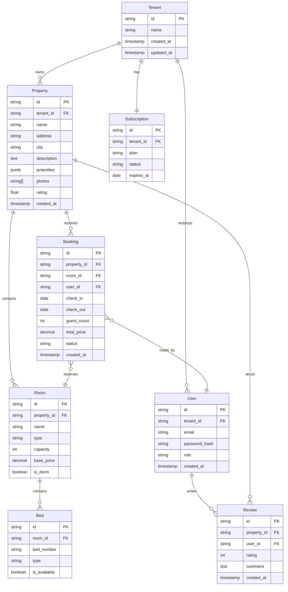
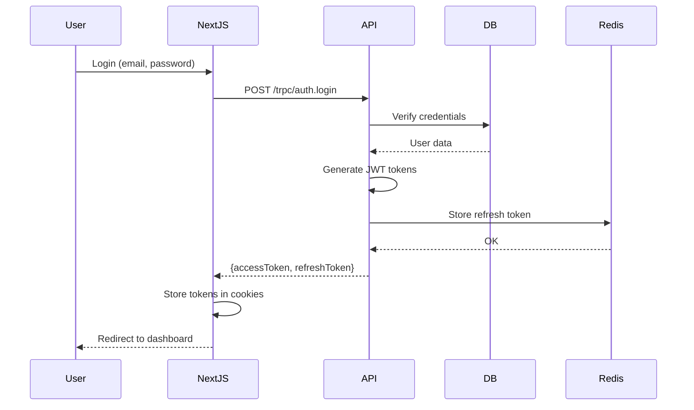
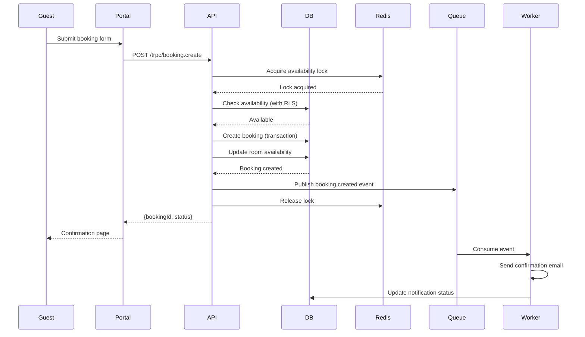
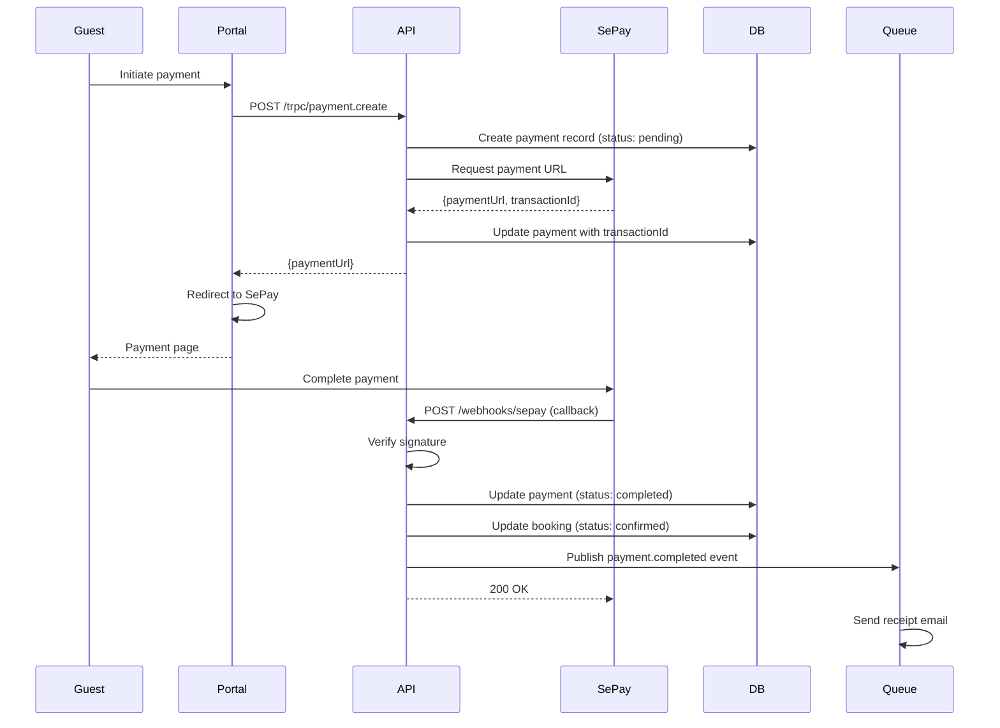
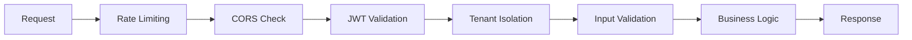
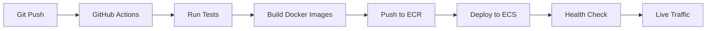

# HostelViet - System Architecture

**Version:** 1.0
**Last Updated:** 2026-02-03

## Overview

HostelViet is a multi-tenant B2B SaaS platform built on a modern, scalable architecture supporting both hostel owners and travelers. This document describes the system design, component interactions, and technical decisions.

## Architecture Principles

### Core Principles
- **Multi-Tenancy:** Strict data isolation between hostel organizations
- **Scalability:** Horizontal scaling for all stateless components
- **Security First:** Defense in depth with multiple security layers
- **Developer Experience:** Type-safe APIs, fast builds, hot reload
- **Cost Efficiency:** Optimize resource usage, leverage managed services

## High-Level Architecture



## System Components

### 1. Frontend Applications

#### Guest Portal (Next.js 15)
**Purpose:** Public-facing booking platform for travelers

**Technology Stack:**
- Framework: Next.js 15 (App Router)
- Styling: Tailwind CSS + shadcn/ui
- State: React Context + tRPC hooks
- Forms: React Hook Form + Zod validation

**Key Features:**
- Server-side rendering for SEO
- Client-side search with debouncing
- Optimistic UI updates
- Progressive image loading

**Routes:**
```
/                       # Homepage with featured hostels
/search                 # Search results with filters
/properties/:id         # Property detail page
/booking/:id            # Booking flow
/auth/login            # Guest login
/auth/register         # Guest registration
/profile               # Guest profile and bookings
```

#### Owner Dashboard (Next.js 15)
**Purpose:** Management interface for hostel owners

**Technology Stack:**
- Framework: Next.js 15 (App Router)
- Styling: Tailwind CSS + shadcn/ui
- Charts: Recharts
- State: Zustand + tRPC

**Key Features:**
- Real-time booking updates via SSE
- Interactive analytics dashboard
- Multi-property management
- Staff role management

**Routes:**
```
/dashboard              # Overview with stats
/properties            # Property management
/bookings              # Booking calendar
/analytics             # Revenue reports
/staff                 # Staff management
/settings              # Account settings
/subscription          # Billing and plans
```

### 2. Backend API (NestJS)

**Architecture:** Modular monolith with domain-driven design

```
api/
├── auth/              # JWT authentication
├── booking/           # Booking domain
├── property/          # Property management
├── user/              # User management
├── payment/           # Payment integration
├── subscription/      # Subscription handling
├── notification/      # Email/SMS notifications
└── common/
    ├── guards/        # Auth guards
    ├── decorators/    # Custom decorators
    ├── filters/       # Exception filters
    └── interceptors/  # Logging, caching
```

#### Communication Protocols

**tRPC (Primary)**
- Type-safe client-server communication
- Automatic TypeScript type generation
- Reduced boilerplate vs REST
- Used for all frontend-backend communication

**REST (Secondary)**
- Webhook endpoints for payment providers
- Third-party API integrations
- Health check endpoints

**Server-Sent Events (SSE)**
- Real-time booking updates
- Notification streaming
- Availability changes

### 3. Database Layer

#### PostgreSQL (Primary Datastore)

**Version:** 16+
**Multi-Tenancy Strategy:** Row-Level Security (RLS)

**Schema Design:**



**Indexes:**
```sql
-- Performance-critical indexes
CREATE INDEX idx_properties_tenant_id ON properties(tenant_id);
CREATE INDEX idx_properties_city ON properties(city);
CREATE INDEX idx_bookings_property_dates ON bookings(property_id, check_in, check_out);
CREATE INDEX idx_bookings_user_id ON bookings(user_id);
CREATE INDEX idx_users_email ON users(email);

-- Full-text search
CREATE INDEX idx_properties_search ON properties USING GIN(to_tsvector('english', name || ' ' || description));
```

**Row-Level Security Example:**
```sql
-- Enable RLS on properties table
ALTER TABLE properties ENABLE ROW LEVEL SECURITY;

-- Policy: Users can only see properties in their tenant
CREATE POLICY tenant_isolation ON properties
  FOR ALL
  USING (tenant_id = current_setting('app.current_tenant_id')::text);
```

#### Redis (Cache Layer)

**Use Cases:**
- Session storage (JWT refresh tokens)
- Query result caching (property listings)
- Rate limiting counters
- Real-time availability locks

**Data Structures:**
```
# Session cache
session:{userId} -> JSON (TTL: 7 days)

# Property cache
property:{id} -> JSON (TTL: 1 hour)

# Search results cache
search:{hash} -> JSON (TTL: 5 minutes)

# Rate limiting
rate:{ip}:{endpoint} -> Counter (TTL: 1 minute)

# Availability lock
lock:booking:{roomId}:{date} -> String (TTL: 5 minutes)
```

### 4. Message Queue (RabbitMQ)

**Purpose:** Asynchronous job processing

**Queues:**
- `email.notifications` - Booking confirmations, reminders
- `sms.notifications` - Urgent alerts
- `payment.processing` - Payment status updates
- `analytics.events` - Usage tracking

**Exchange Types:**
- Direct exchange for routing by queue name
- Fanout exchange for broadcasting events

**Worker Pattern:**
```typescript
// Email worker example
@Injectable()
export class EmailWorker {
  @RabbitSubscribe({
    exchange: 'notifications',
    routingKey: 'email.booking.confirmation',
    queue: 'email.notifications',
  })
  async handleBookingConfirmation(msg: BookingConfirmationEvent) {
    await this.emailService.sendBookingConfirmation({
      to: msg.guestEmail,
      bookingId: msg.bookingId,
      propertyName: msg.propertyName,
      checkIn: msg.checkIn,
      checkOut: msg.checkOut,
    });
  }
}
```

### 5. File Storage (S3/Cloudinary)

**Storage Strategy:**
- **S3:** Property photos, user avatars
- **Cloudinary (Alternative):** Automatic image optimization

**Folder Structure:**
```
s3://hostelviet-uploads/
├── properties/
│   ├── {propertyId}/
│   │   ├── images/
│   │   │   ├── original/
│   │   │   ├── thumbnail/
│   │   │   └── optimized/
│   └── ...
└── users/
    ├── avatars/
    │   ├── {userId}.jpg
    └── ...
```

**Image Processing Pipeline:**
1. Upload original to S3
2. Trigger Lambda/Worker for resizing
3. Generate thumbnails (400x300) and optimized (1200x675)
4. Store URLs in database
5. Serve via CloudFront CDN

## Data Flow Diagrams

### 1. User Authentication Flow



### 2. Booking Creation Flow



### 3. Payment Processing Flow



## Multi-Tenancy Architecture

### Isolation Strategy

**Row-Level Security (RLS) in PostgreSQL**

```typescript
// Middleware to set tenant context
@Injectable()
export class TenantContextMiddleware implements NestMiddleware {
  async use(req: Request, res: Response, next: NextFunction) {
    const user = req.user as AuthUser;

    if (user?.tenantId) {
      // Set session variable for RLS
      await this.prisma.$executeRaw`
        SET LOCAL app.current_tenant_id = ${user.tenantId}
      `;
    }

    next();
  }
}

// All queries automatically filtered by tenant
const properties = await prisma.property.findMany(); // Only returns current tenant's properties
```

### Tenant Isolation Guarantees

1. **Data Isolation:** RLS policies prevent cross-tenant queries
2. **Schema Isolation:** All tables have `tenant_id` column
3. **Cache Isolation:** Redis keys include tenant ID
4. **File Isolation:** S3 folders namespaced by tenant
5. **Queue Isolation:** Messages tagged with tenant context

## Security Architecture

### Authentication & Authorization

**JWT Token Strategy:**
```typescript
{
  accessToken: {
    payload: { userId, tenantId, role },
    expiry: 15 minutes,
    storage: httpOnly cookie
  },
  refreshToken: {
    payload: { userId, tokenId },
    expiry: 7 days,
    storage: httpOnly cookie + Redis
  }
}
```

**Role Hierarchy:**
```
Owner (all permissions)
  └── Manager (property management, bookings, staff)
      └── Receptionist (bookings, check-in/out)
          └── Cleaner (view assignments)
Guest (public booking only)
```

### API Security Layers



**Security Mechanisms:**
- **Rate Limiting:** 100 req/min per IP for public APIs
- **CORS:** Whitelist only known domains
- **CSRF Protection:** SameSite cookies + CSRF tokens
- **SQL Injection:** Prisma parameterized queries
- **XSS Protection:** React auto-escaping + CSP headers
- **Secrets Management:** Environment variables + AWS Secrets Manager

### Data Encryption

- **In Transit:** TLS 1.3 for all connections
- **At Rest:** PostgreSQL encryption, S3 bucket encryption
- **Passwords:** bcrypt with salt rounds = 12
- **Sensitive Fields:** AES-256 for payment details

## Scalability Strategy

### Horizontal Scaling

**Stateless API Servers:**
- Auto-scaling based on CPU (target: 70%)
- Kubernetes deployment with 2-10 replicas
- Session data in Redis (shared state)

**Database Scaling:**
- Read replicas for analytics queries
- Connection pooling (Prisma: max 100 connections)
- Partitioning by tenant for large tables

**Cache Scaling:**
- Redis Cluster for high availability
- Cache invalidation via pub/sub
- TTL-based expiration

### Performance Optimization

**Database:**
- Indexed queries on tenant_id, dates, status
- Materialized views for analytics
- Query result caching (5-60 minutes)

**Frontend:**
- Code splitting per route
- Image lazy loading
- Static asset CDN (CloudFront)
- Server-side rendering for SEO

**API:**
- Response compression (gzip)
- Database query batching
- Parallel processing for independent operations

## Monitoring & Observability

### Logging (ELK Stack)

**Log Levels:**
- ERROR: Application errors, exceptions
- WARN: Degraded performance, retries
- INFO: Business events (bookings, payments)
- DEBUG: Development debugging

**Log Structure:**
```json
{
  "timestamp": "2026-02-03T10:30:00Z",
  "level": "INFO",
  "service": "api",
  "traceId": "abc123",
  "tenantId": "tenant-1",
  "userId": "user-1",
  "message": "Booking created",
  "context": {
    "bookingId": "book-1",
    "propertyId": "prop-1",
    "amount": 150
  }
}
```

### Metrics (Prometheus)

**Key Metrics:**
- Request rate (req/sec)
- Response time (p50, p95, p99)
- Error rate (errors/sec)
- Database query time
- Cache hit rate
- Queue depth

**Dashboards (Grafana):**
- System health overview
- API performance
- Database performance
- Business metrics (bookings, revenue)

### Alerts

**Critical Alerts:**
- API error rate >5%
- Database connection pool exhausted
- Payment webhook failures
- Disk usage >85%

**Warning Alerts:**
- Response time p95 >500ms
- Cache hit rate <80%
- Queue depth >1000 messages

## Disaster Recovery

### Backup Strategy

**Database Backups:**
- Automated daily backups (PostgreSQL)
- Point-in-time recovery (7 days)
- Cross-region replication

**File Backups:**
- S3 versioning enabled
- Lifecycle policy: archive after 90 days

### High Availability

- Multi-AZ deployment (AWS)
- Database failover automation
- Redis Sentinel for HA
- RabbitMQ clustering

**RTO/RPO Targets:**
- Recovery Time Objective: <1 hour
- Recovery Point Objective: <15 minutes

## Technology Decisions

### Why Turborepo?
- Unified build pipeline
- Shared package management
- Incremental builds (faster CI/CD)

### Why Next.js 15?
- App Router for better performance
- Built-in SSR/SSG
- API routes for serverless functions
- Excellent DX with Fast Refresh

### Why NestJS?
- Modular architecture
- Dependency injection
- TypeScript-first
- Extensive ecosystem

### Why tRPC?
- Type safety end-to-end
- No code generation needed
- Automatic API documentation
- Better DX than REST

### Why PostgreSQL?
- ACID compliance
- Row-level security (RLS)
- Full-text search
- JSON support
- Mature ecosystem

### Why Redis?
- Sub-millisecond latency
- Rich data structures
- Pub/Sub for real-time
- Proven at scale

## Deployment Architecture

### Infrastructure (AWS)

```
Production Environment:
├── VPC (Multi-AZ)
│   ├── Public Subnets (Load Balancers)
│   ├── Private Subnets (API Servers)
│   └── Database Subnets (RDS, ElastiCache)
├── ECS/EKS (Container Orchestration)
├── RDS PostgreSQL (Multi-AZ)
├── ElastiCache Redis (Cluster)
├── S3 (File Storage)
├── CloudFront (CDN)
└── Route 53 (DNS)
```

### CI/CD Pipeline



---

**Document Owner:** Solutions Architect
**Last Review:** 2026-02-03
**Next Review:** 2026-03-03
